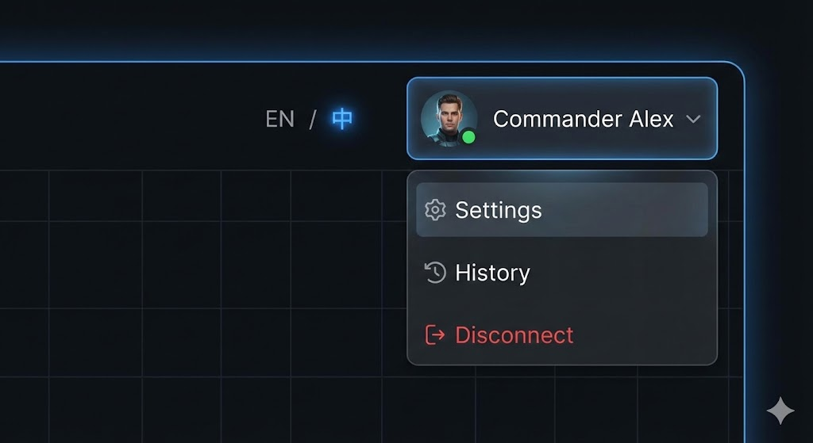
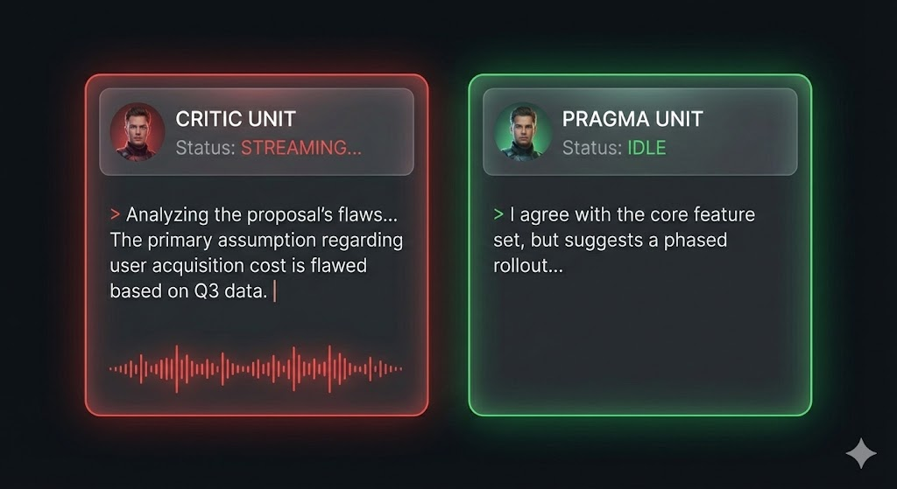
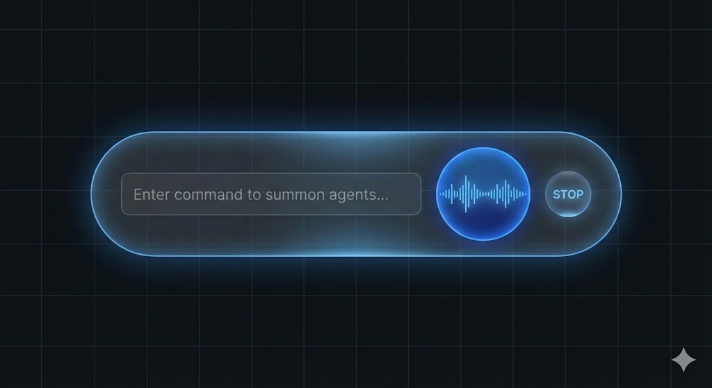
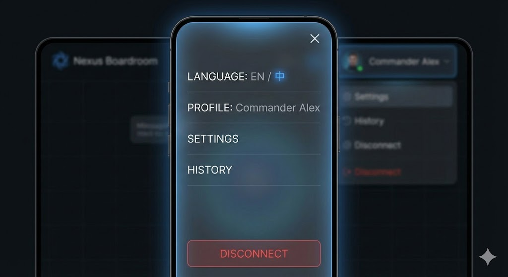
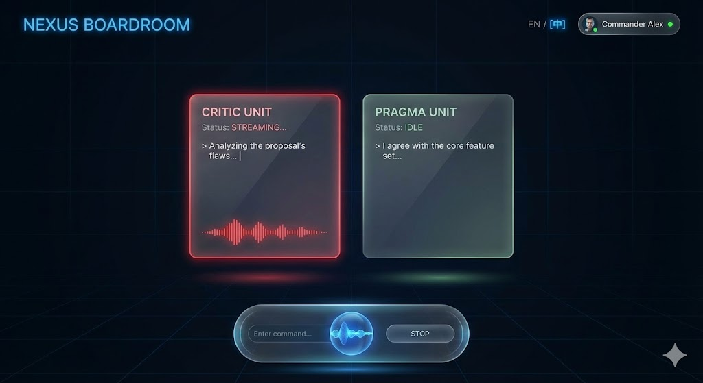

### 1. 顶部 HUD 导航栏 (Top HUD Navigation)

这个模块展示了位于右上角的悬浮导航栏。多语言切换器和用户资料以“幽灵态”存在，不干扰主界面，仅在交互时高亮。点击用户头像会弹出一个磨砂玻璃风格的下拉菜单。

---

### 2. Agent 卡片状态细节 (Agent Card States)

这张图详细展示了两个 Agent 卡片的不同状态。左侧的 "CRITIC UNIT" 处于 **Streaming** 状态，带有红色的光效、打字机光标和底部的动态波形。右侧的 "PRAGMA UNIT" 则处于 **Idle** 状态，光效和内容都是静态的。

---

### 3. 底部悬浮控制台 (Bottom Floating Console)

这是底部的输入和控制区域。它采用胶囊形状的磨砂玻璃设计，包含输入框、一个活跃的蓝色球形频谱仪（Visualizer）以及一个发光的停止按钮，整体悬浮于背景之上。

---

### 4. 移动端菜单覆盖层 (Mobile Menu Overlay)

最后是移动端的适配方案。当用户在手机上点击菜单按钮时，会弹出这个全屏的磨砂玻璃覆盖层。它提供了大尺寸的触控选项来进行语言切换和访问用户设置，确保了在小屏幕上的可用性。

这些模块化的视觉稿为你提供了 Nexus Boardroom 界面设计的完整蓝图。你可以将它们直接提供给开发团队进行实现。
